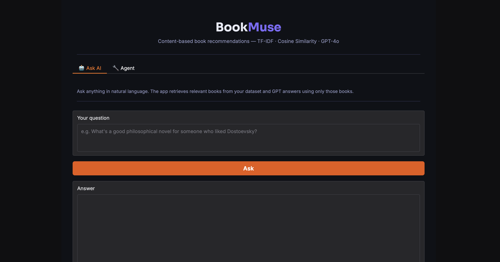
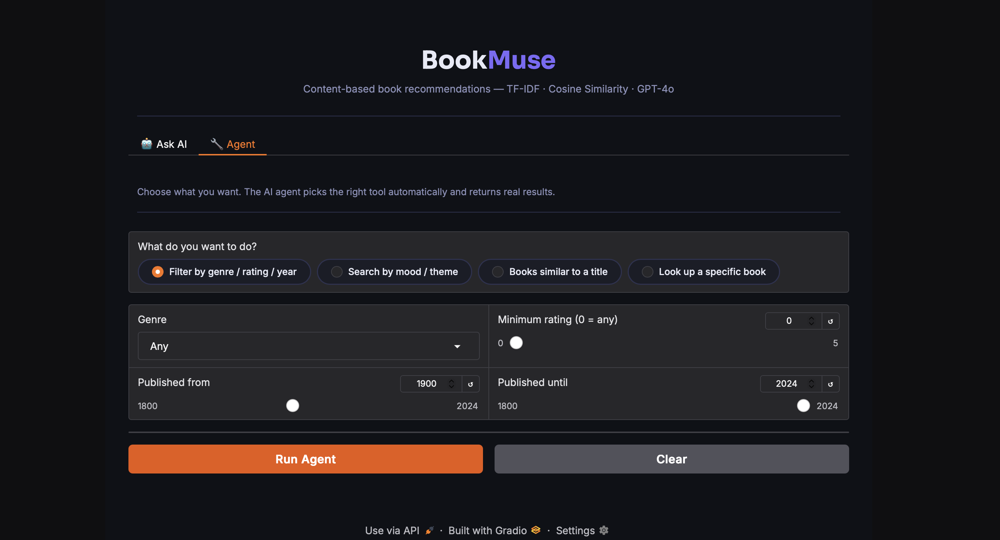
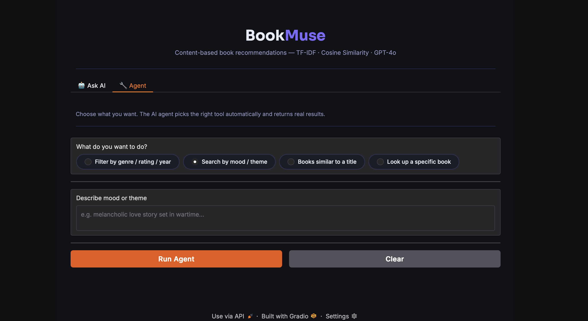
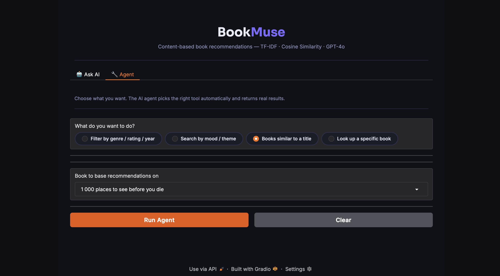
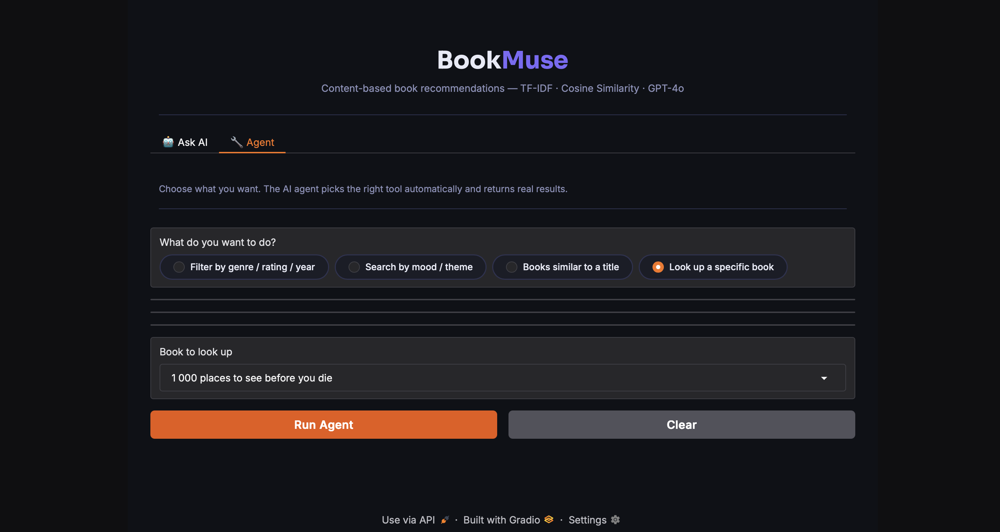

# 📚 BookMuse – Book Recommender System  
**NLP Project – EADA**

---

## 1. Project Overview

BookMuse is a content-based book recommendation system built using Natural Language Processing (NLP) techniques.

The system allows users to discover books in two main ways:
- interacting with an AI assistant
- using an agent with multiple tools

The goal of this project was not only to build a working recommender, but to design a complete pipeline from raw text data to an interactive application.

---

## 2. What Makes This Project Different

Compared to standard TF-IDF recommender systems, we extended our project with:

- 🎯 Interactive web interface (Gradio)
- 🤖 AI-powered “Ask AI” feature (RAG-based approach)
- ⚙️ Agent system with multiple tools
- 🔍 Multiple ways to interact with the same model

This makes the system closer to a real product rather than a simple model.

---

## 3. Dataset Description

We use a dataset of book metadata (`books.csv`) including:

- `title`
- `authors`
- `categories`
- `description`
- `average_rating`
- `ratings_count`
- `thumbnail`

For recommendations, we focus on textual features:

- title  
- authors  
- categories  
- description  

These are combined into a single field (`combined_text`).

---

## 4. Methodology

### 4.1 Preprocessing

We:
1. Load the dataset  
2. Handle missing values  
3. Combine text fields into one column  
4. Convert text to lowercase  
5. Prepare it for vectorization  

---

### 4.2 TF-IDF Vectorization

We use:

- `TfidfVectorizer`
- n-grams (1,2)
- max_features = 50,000

This converts each book into a numerical vector based on word importance.

---

### 4.3 Similarity – Cosine Similarity

We compute similarity between books using cosine similarity:

- 1 → very similar  
- 0 → not related  

Then we return Top-K most similar books.

---

## 5. Features

The system offers two main interaction modes:

### 🤖 1. Ask AI (RAG-based)

Users can ask questions in natural language.

The system:
1. Retrieves relevant books from the dataset  
2. Sends them to GPT  
3. Generates an answer based only on retrieved data  

---

### ⚙️ 2. Agent Mode

The agent allows users to perform different tasks using one interface.

Available actions:

- Filter by genre, rating, and year  
- Search by mood or theme  
- Find books similar to a selected title  
- Look up a specific book  

The agent selects the correct logic based on user choice.

---

## 6. System Architecture

User → Gradio UI  
↓  
BookRecommender (TF-IDF)  
↓  
Cosine Similarity  
↓  
Ranked Results  

+ AI Layer (RAG):  
User Query → Retrieve Books → GPT → Answer  

Modules:

- `src/preprocessing.py` → data preparation  
- `src/recommender.py` → recommendation logic  
- `app.py` → UI + interaction  

---

## 7. Demo

### Ask AI Interface  


### Agent – Filter Mode  


### Agent – Theme Search  


### Agent – Similar Books  


### Agent – Book Lookup  


---

## 8. Limitations

- Uses TF-IDF → limited semantic understanding  
- No collaborative filtering (no user behavior)  
- Depends on quality of book descriptions  
- AI answers depend on retrieved data  

---

## 9. Future Improvements

- Use embeddings (Sentence-BERT) for better semantic understanding  
- Build a hybrid recommender system (content + collaborative filtering)  
- Deploy as a scalable web application  

---

## 10. How to Run the Project

```bash
python -m venv .venv
source .venv/bin/activate
pip install -r requirements.txt
python app.py
```
